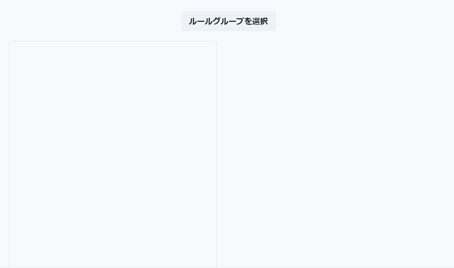
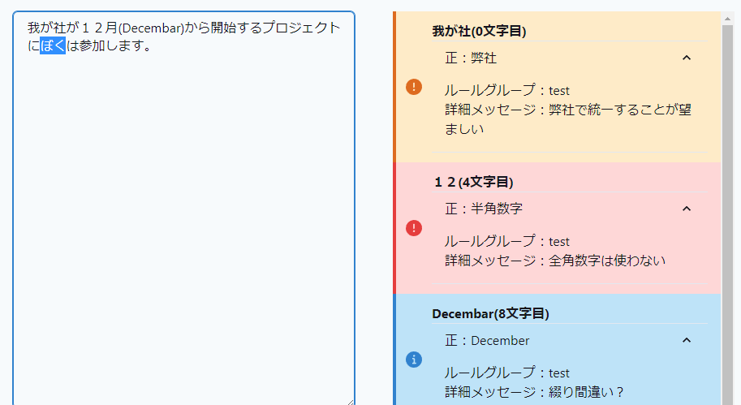
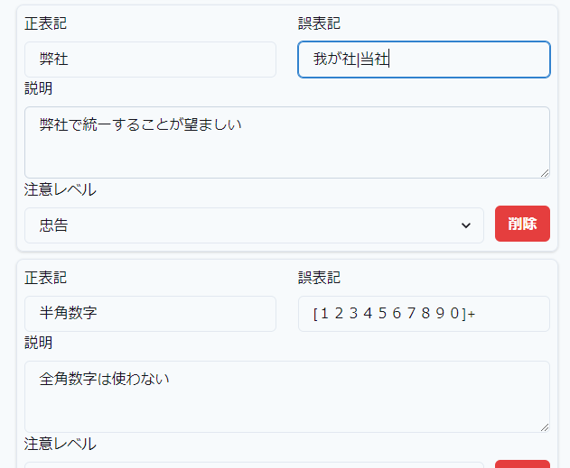
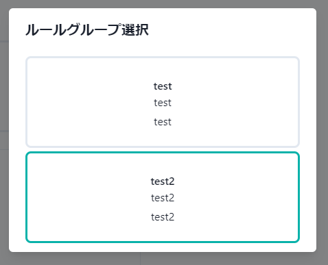

# TEXT CHECKER
ルールセットを切り替え可能な表記確認アプリ



# 特徴
## リアルタイムで確認可能な表記チェック


## 正規表現で記述可能なルールセット


警告メッセージや警告レベルも設定可能

## 複数に分けて管理可能なルールセット


ルールセットを細かく分けて管理して、場合に分けて適用可能

# 起動方法
## データベース
mongodbを使っています。ローカル環境を汚したくない場合、dockerを使える環境で、
```
docker-compose up
```
でmongodbを起動可能です。

## アプリケーション
nodeとnpmが使える環境で、
```
npm install
npm run dev
```
で起動可能です。